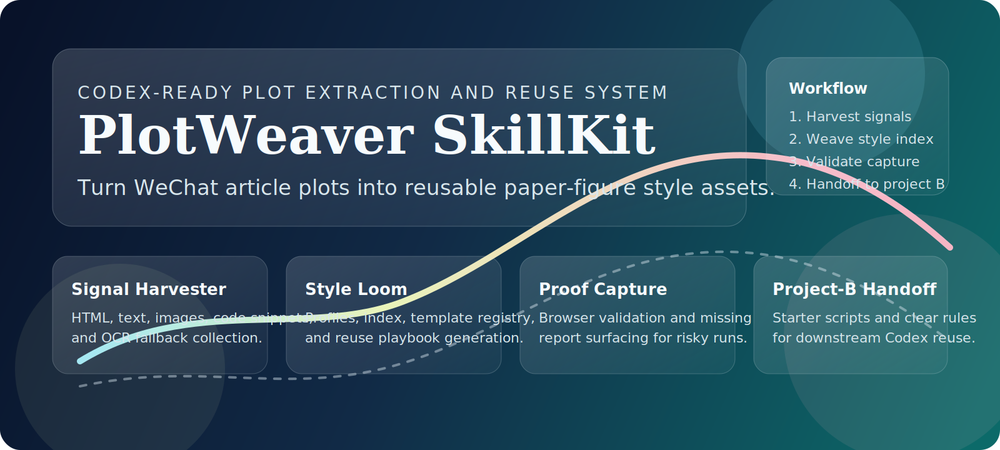
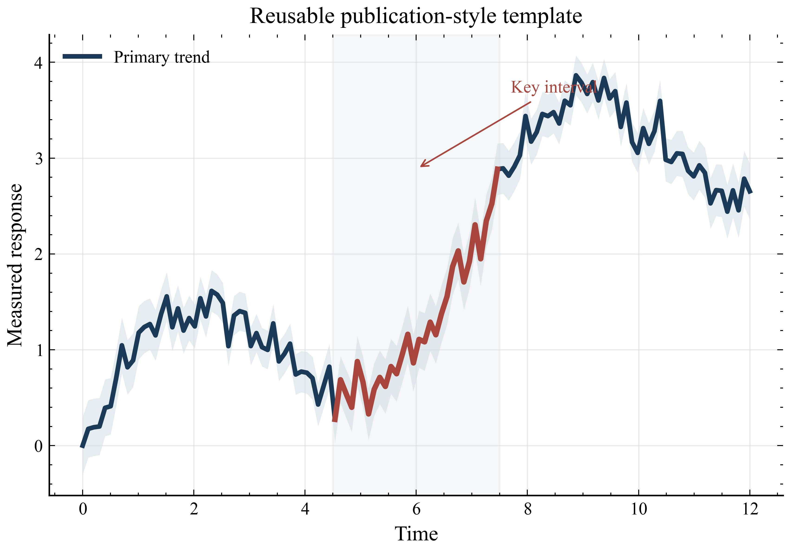

# Plotweaver Skillkit

<!-- PORTFOLIO-SNAPSHOT:START -->
<p align="left">
  
  
</p>

> Codex-ready skill and Python toolkit for extracting plotting styles from WeChat articles and reusing them in paper figures.

## Project Snapshot

- Category: AI-assisted workflow tooling
- Stack: Python, academic-figures, codex-skill, data-visualization, matplotlib, python
- Status: Public portfolio artifact

## What This Demonstrates

- Presents the project with a clear purpose, technology stack, and review path.
- Shows applied AI workflow design in a concrete product or learning scenario.
- Keeps implementation details and usage notes close to the code for easier reuse.

## Quick Start

```bash
python -m pip install -e . && python -m compileall .
```

<!-- PORTFOLIO-SNAPSHOT:END -->

## Original Documentation

[English](README.en.md)

<p align="center">
  
</p>

<p align="center">
  <a href="https://github.com/handsomeZR-netizen/plotweaver-skillkit"></a>
  <a href="https://github.com/handsomeZR-netizen/plotweaver-skillkit"></a>
  <a href="https://playwright.dev/"></a>
  <a href="https://github.com/garrettj403/SciencePlots"></a>
  <a href="LICENSE"></a>
  <a href="https://github.com/handsomeZR-netizen/plotweaver-skillkit/stargazers"></a>
</p>

> 面向 Codex 的公众号绘图风格提取与论文复用工具链。
>
> A Codex-ready skill + toolkit for turning WeChat article plots into reusable paper-figure style assets.

`PlotWeaver SkillKit` 把两类能力打包进了同一个仓库：

- 一个 `wechat-plotkit` Python 工具包，负责抓取文章内容、抽取绘图信号、构建风格索引，并做浏览器校验
- 两个面向 Codex 的 repo-local skills，负责把原始公众号链接变成可复用风格资产，再把这些资产变成下游论文项目可直接接手的 starter plotting code

这个仓库不是为了“一次性抓完一批文章”而设计的，而是为了构建一套可持续复用的 style pack。你可以先分析一批公众号绘图文章，再让 Codex 在项目 B 里同时读取这份风格包和项目代码，从而更稳定地复用配色、布局、注释密度和整体图形语言。

## 这个仓库解决什么问题

市面上很多相近方案通常只做到其中一层：

- 只做爬取，保存 HTML 和图片，但不显式总结绘图风格决策
- 只做截图收藏，能看灵感，但不能转成稳定的复用代码路径
- 只靠一次 prompt 模仿风格，能临时出图，但很难跨项目保持一致的风格记忆

`PlotWeaver SkillKit` 重点做的是“从灵感到复用”的交接层。

- `Signal Harvester`：抓取 HTML、正文、图片、高置信代码片段，以及 OCR 回退候选
- `Style Loom`：把每篇文章沉淀为 `style_profile.json`，再把整批文章汇总为 `master_style_index.json`、`template_registry.json` 和 `reuse_playbook.md`
- `Proof Capture`：用浏览器抽样截图和缺失报告去验证抽取结果，而不是盲信抓取
- `Project-B Handoff`：生成 starter plotting script 和明确的复用规则，方便 Codex 在下游论文项目里直接接手

## 和同类方案的差异点

| 常见做法 | PlotWeaver SkillKit |
| --- | --- |
| 只保存页面和图片 | 直接产出可复用的风格数据集，包含 plot types、palette、confidence、layout pattern 和模板建议 |
| 直接相信抓到的代码片段 | 区分高置信代码、OCR 提示和人工复核路径，避免低质量抽取直接进入生产图 |
| 只适合单次批处理 | 目标是形成一个可移植的 style pack，后续可以放进项目 B 继续复用 |
| 重心在爬取 | 重心在复用，提供 template registry、starter code generation、theme entrypoint 和 reuse playbook |
| 没有校验层 | 加入浏览器抽样验证和 missing report，能更早暴露漏抓与抽取缺口 |

## 你会得到什么

使用 `PlotWeaver SkillKit`，你拿到的不只是“抓下来的文章内容”，而是一套真正能继续用下去的风格资产：

- `master_style_index.json`：把一整批绘图灵感压缩成一份可读、可索引、可搜索的风格地图
- `style_profile.json`：把单篇文章的配色、布局、注释密度、图形类型单独沉淀下来
- `template_registry.json`：告诉 Codex 这份风格更适合映射到哪类 starter template
- `reuse_playbook.md`：把“怎么复用这套风格”写成可直接执行的策略说明
- starter plotting scripts：把灵感快速落成可运行的示例代码，而不是只停留在截图和观感层面

换句话说，它交付的是一套可以被反复调用的“风格记忆”，而不是一次性的抓取结果。

## 适合谁用

- 想给自己的 Codex 配一套稳定科研绘图工作流的人
- 经常参考公众号、教程号、科研绘图博主文章的人
- 需要把灵感快速迁移到论文项目、汇报图表或实验可视化中的人
- 不想每次都重新解释“我要这个风格、这个配色、这个版式”的人

## 使用场景

- 从一批公众号绘图文章中提取统一风格，做成私有 style pack
- 把 style pack 放进新的论文项目里，让 Codex 直接沿用已有视觉语言
- 为不同图型自动挑选更贴近原风格的 starter template
- 为自己的 skill 生态准备一套长期可复用的科研绘图参考底座

## 快速开始

### 1. 安装

```powershell
python -m pip install -e .[dev,style]
python -m playwright install chromium
```

如果你本地还准备启用 OCR：

```powershell
python -m pip install -e .[ocr]
```

### 2. 分析 Markdown 链接清单

```powershell
wechat-plotkit analyze-links --input .\links.md --out .\runs\demo --validate --sample-mode risk_based --sample-limit 3
```

### 3. 重建索引或重新执行校验

```powershell
wechat-plotkit build-style-index --run .\runs\demo
wechat-plotkit validate-capture --run .\runs\demo --sample-mode manual_only --sample-limit 5
```

### 4. 从风格源生成 starter plotting script

```powershell
wechat-plotkit generate-example --style-source .\examples\demo_pack\master_style_index.json --template scatter --output .\exports
```

## Codex Skill 入口

这个仓库同时提供两个 repo-local skills：

- `wechat-analysis`：从原始公众号链接出发，生成一份新的可复用风格数据集
- `plot-style-reuse`：从现有 style source 出发，自动选择最合适的 starter template，并生成示例脚本

调用示例：

```powershell
python .agents/skills/wechat-analysis/scripts/preflight_check.py --input .\links.md --out .\runs\demo --validate
python .agents/skills/wechat-analysis/scripts/run_analysis.py --input .\links.md --out .\runs\demo --validate
python .agents/skills/plot-style-reuse/scripts/select_template.py --style-source .\examples\demo_pack\master_style_index.json
python .agents/skills/plot-style-reuse/scripts/generate_plot_example.py --style-source .\examples\demo_pack\master_style_index.json --output .\exports
```

## 精简演示包

为了让公开仓库足够轻量，这里保留了一套可以直接拿来体验和展示的精简 demo：

- [`examples/demo_pack/master_style_index.json`](examples/demo_pack/master_style_index.json)
- [`examples/demo_pack/template_registry.json`](examples/demo_pack/template_registry.json)
- [`examples/demo_pack/reuse_playbook.md`](examples/demo_pack/reuse_playbook.md)
- [`examples/demo_pack/style_profile_radar.json`](examples/demo_pack/style_profile_radar.json)
- [`examples/demo_pack/article_radar.json`](examples/demo_pack/article_radar.json)

这套 demo 足够展示下游项目和 Codex 真正会消费的文件形状，也方便你快速理解这套工具链的最终效果。

## 预览



## 如何接入你的项目

推荐的下游目录结构：

```text
project-b/
  vendor/
    plotweaver-skillkit/
  src/
  data/
```

推荐的 Codex 读取顺序：

1. `master_style_index.json`
2. `template_registry.json`
3. `reuse_playbook.md`
4. 与目标图最接近的 `article.json` 或 `style_profile.json`
5. `style_kit/theme.py`

## 仓库结构

```text
.agents/                 Codex skills 和 wrapper scripts
docs/                    使用说明、集成文档、展示素材
examples/demo_pack/      轻量级公开演示产物
style_kit/               主题入口和调色板资产
templates/               starter plotting templates
tests/                   包级测试和 skill workflow 测试
wechat_plotkit/          核心工具包
```

## 为什么值得放进你的 Skill 工具箱

- 它不是单一脚本，而是一套完整的 `Skill + Toolkit + Template + Style Pack` 组合
- 它不是只给当前批次服务，而是能反复沉淀你的绘图偏好和视觉资产
- 它不是只负责“看起来像”，而是帮助 Codex 更稳定地“持续做出像”
- 它非常适合作为你整个科研绘图 skill 体系中的基础设施仓库

## 一句话宣传语

> PlotWeaver SkillKit，让公众号里的绘图灵感真正变成你自己的长期风格资产。
